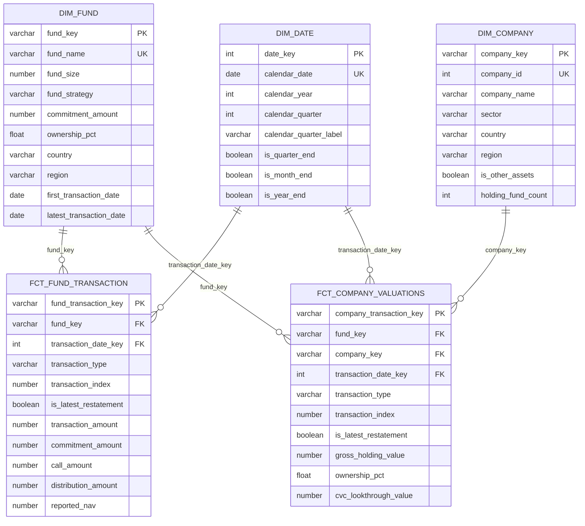

# CVC Secondary Partners — Home Assignment Solution

## 1. Executive Summary

This submission is a complete dbt/Snowflake solution for the CVC Secondary Partners
portfolio monitoring extract. It transforms two raw tables (`fund_data` and
`company_data`) into a dimensional model that supports fund-level NAV, company-level
NAV, ownership scaling and reconciliation.

All code is in the dbt project `pe_secondary_data_dbt`. The latest full build
produced:

```text
0 seeds, 10 table models, 93 data tests — PASS=103, ERROR=0, WARN=0
```

Key file locations:

| Deliverable | File |
|---|---|
| Complete assignment solution (this document) | `docs/home_assignment_solution.md` |
| Task 2.1 standalone fund NAV query | `analyses/exercise_2_1_fund_nav.sql` |
| Task 2.2 productionised company NAV (commitment method) | `models/marts/fct_company_nav.sql` |
| Task 2.3 standalone implied company NAV query | `analyses/exercise_2_3_company_nav_implied.sql` |
| Task 2.3 method comparison | `analyses/exercise_2_3_method_comparison.sql` |
| Task 3.1 data-quality tests | `tests/assert_transaction_date_valid.sql` |
| | `tests/assert_duplicate_companies.sql` |
| | `models/staging/schema.yml` (not_null tests) |

---

## 2. Task 1 — Data Modeling

### 2.1 The central finding: the two tables are stated at different ownership levels

`company_data` holds the **gross** company valuation at 100% of the holding fund.
`fund_data` holds CVC's **pro-rata** share. The ratio between them is
`commitment_amount / fund_size`:

| Fund | Fund size | CVC commitment | Implied stake |
|---|---|---|---|
| Palisade Ridge Capital | 970,000,000 | 9,700,000 | 1.0% |
| Summitvale Equity Group | 250,000,000 | 12,500,000 | 5.0% |
| Ironbrook Capital Partners | 50,000,000 | 50,000,000 | 100.0% |

Scaling the summed company holdings by this stake reproduces the reported fund NAV
**exactly** for 10 of 12 fund/date pairs. This is too consistent to be accidental,
so the two failures (Summitvale at 2020-12-31 and 2021-03-31) are treated as
unexplained source breaks, not a broken model.

### 2.2 Schema choice: why these tables

| Table | Type | Grain | Rows | Purpose |
|---|---|---|---|---|
| `dim_fund` | Dimension | one row per fund | 3 | Conformed fund attributes, latest size, commitment and inferred ownership |
| `dim_company` | Dimension | one row per `company_id` | 10 | Conformed company attributes; a company can be held by multiple funds |
| `dim_date` | Dimension | one row per calendar day | 731 | Date intelligence (`is_quarter_end`, etc.) over 2020–2021 |
| `fct_fund_transaction` | Transaction fact | fund × type × date × restatement index | 22 | All fund-level events including restatements; filter on `is_latest_restatement` |
| `fct_company_valuations` | Transaction fact | fund × company × type × date × restatement index | 61 | All company-level valuation events |
| `fct_fund_nav` | Snapshot/rolled | fund × report date | 16 | Fund NAV over time, matching the expected Excel output |
| `fct_company_nav` | Derived fact | fund × company × report date | 61 | Company NAV using cumulative-commitment ownership (method 1) |
| `fct_company_nav_implied` | Derived fact | fund × company × report date | 59 | Company NAV using fund-NAV/sum-companies ownership (method 2) |

**Why two separate fact tables?** Fund-level cashflows (Commitment, Call, Distribution)
have no company attribution. Forcing them into a single fact table would create
`company_key = null` rows and break the FK, so a constellation with conformed
dimensions is the cleaner pattern.

**Why `dim_company` is keyed on `company_id` alone.** `company_id` 916 (Zephiron
Biopharma) appears under both Palisade and Summitvale with the same company name
and attributes. Keying on `(fund, company)` would duplicate the company and prevent
the question *"what is our total exposure to Zephiron?"* from being answerable in
one join.

### 2.3 Schema diagram



### 2.4 Technical observations and challenges

1. **`transaction_index` is a restatement version, not a sequence.** For Palisade at
   2020-12-31 the `1.0` valuation is 8,000,000, but `2.0` is 8,500,000 — the
   expected output. Ignoring this returns a wrong NAV on 3 of 13 fund-quarters
   with no error.
2. **`sector` means two different things.** In `fund_data` it is fund *strategy*
   (`Private Equity`, `Venture Capital`); in `company_data` it is *industry*
   (`Healthcare`, `Industrials`). Renamed the former to `fund_strategy` in staging.
3. **No load metadata.** No `extracted_at`, `batch_id` or `source_system`. With
   restatements present, this makes *"what did we report last quarter?"* unanswerable.
4. **The only fund identifier is `fund_name`.** A GP rebranding would silently fork
   a fund into two rows.
5. **No currency field.** Funds are domiciled in the US, France, UK, Sweden and
   Luxembourg; cross-fund sums may be adding different currencies.
6. **Sign conventions are undocumented but consistent.** Distributions are negative,
   calls and commitments are positive.
7. **`Other Assets` (`company_id = 1`) is a balancing plug** carried by every fund,
   with blank sector, country and region.

### 2.5 Data quality issues

| # | Issue | Evidence | Severity |
|---|---|---|---|
| 1 | Inconsistent country naming (`USA` vs `United States`) | Standardised in staging | High — fixed |
| 2 | Summitvale company NAV does not tie to fund NAV on 2020-12-31 (-400,000) and 2021-03-31 (+200,000) | 10 other pairs reconcile exactly | High — unexplained |
| 3 | Ironbrook company data dated 2020-06-30 but fund reports 2021-06-30; totals match exactly | 100%-owned, so the two should coincide | High — likely mistyped year |
| 4 | `transaction_index` includes `1.000021` among otherwise integral values | Source data | Medium |
| 5 | Index values jump from `1.0` to `7.0` | Summitvale 2021-12-31 | Medium — missing restatement history |
| 6 | `Other Assets` is a plug, not a real company | company_id = 1, blank attributes | Medium — flagged |
| 7 | Ironbrook commitment equals 100% of fund size | 50,000,000 / 50,000,000 | Medium — needs confirmation |
| 8 | No currency field | All amounts bare numbers | High |

### 2.6 What I would add to the extract

Ranked by value:

1. **Explicit ownership/participation percentage per fund per period** — currently
   inferred from `commitment / fund_size`.
2. **A basis flag on every amount** (`gross_100pct` vs `lp_share`) so tables are
   self-describing.
3. **Currency code and FX rate** for every monetary amount.
4. **Stable `fund_id`** alongside `fund_name`; and confirmation that `company_id` is
   global, not per-fund.
5. **Load metadata** (`extracted_at`, `batch_id`, `source_system`, `valid_from`) to
   support bitemporal restatement tracking and incremental loads.
6. **A data dictionary** defining `transaction_index`, sign conventions and the
   closed set of `transaction_type` values.
7. **Company-level cashflows** (cost, proceeds) — without them no MOIC/IRR or gross-to-net.
8. **A separate `Other Assets` marker** instead of overloading `company_id = 1`.

### 2.7 End-to-end Snowflake pipeline

```text
Portfolio monitoring system
        │  scheduled extract (CSV/Parquet + manifest & checksum)
        ▼
Cloud object store  (S3/ADLS, partitioned by extract date)
        ▼
Snowpipe / COPY INTO via external stage
        ▼
RAW  (append-only, immutable history)
        ▼
PREPARATION  (dbt staging: typing, trimming, standardisation)
        ▼
PRESENTATION  (dbt marts: dims and facts)
        ▼
BI / reporting layer
```

- **Ingestion.** External stage with storage integration; `COPY INTO` is idempotent
  per file. Persist `metadata$filename` and `metadata$file_row_number` for lineage.
- **Raw is append-only.** Every extract is retained with `extracted_at`. Given the
  restatement behaviour, this is the only way to defend against silent changes.
- **Transformation.** dbt runs `preparation` → `presentation`. Staging as views,
  marts as tables. Once volume justifies it, `fct_*` become incremental with a
  `merge` on the surrogate key.
- **Restatements.** With an `as_of_date`, `fct_fund_transaction` becomes bitemporal
  (`transaction_date` vs `as_of_date`). `dim_fund` and `dim_company` become dbt
  snapshots (SCD Type 2).
- **Testing.** Run `dbt build`; failure blocks `presentation` from being published.
  Add a reconciliation test (`Σ gross × ownership ≈ fund NAV`) and `dbt_utils.equal_rowcount`
  between raw and staging.

---

## 3. Task 2 — SQL Exercises

### 3.1 Exercise 2.1 — Fund NAV over time

**Definition.** NAV = most recent valuation + all calls and distributions since that
valuation. Commitments are excluded. A later valuation supersedes earlier cashflows.

The standalone query is in `analyses/exercise_2_1_fund_nav.sql`. The three core
rules are:

1. Resolve restatements with the highest `transaction_index`.
2. Each valuation opens a new period; cashflow-only dates inherit the prior period.
3. Commitments are not cashflows.

**Key logic:**

```sql
with current_transactions as (
    select
        fund_name,
        transaction_date::date as transaction_date,
        transaction_type,
        transaction_amount
    from fund_data
    where transaction_type in ('Valuation', 'Call', 'Distribution')
    qualify row_number() over (
        partition by fund_name, transaction_type, transaction_date
        order by transaction_index desc
    ) = 1
),

daily_activity as (
    select
        fund_name,
        transaction_date,
        max(case when transaction_type = 'Valuation' then transaction_amount end) as valuation_amount,
        sum(case when transaction_type <> 'Valuation' then transaction_amount else 0 end) as cashflow_amount
    from current_transactions
    group by fund_name, transaction_date
),

valuation_periods as (
    select
        fund_name,
        transaction_date,
        valuation_amount,
        cashflow_amount,
        count(valuation_amount) over (
            partition by fund_name
            order by transaction_date
            rows between unbounded preceding and current row
        ) as valuation_period
    from daily_activity
)

select
    fund_name,
    transaction_date,
    max(valuation_amount) over (partition by fund_name, valuation_period)
        + sum(cashflow_amount) over (
              partition by fund_name, valuation_period
              order by transaction_date
              rows between unbounded preceding and current row
          ) as nav
from valuation_periods
where valuation_period > 0
order by fund_name, transaction_date
```

**Expected vs actual (16 rows):** all match exactly. Verified by
`tests/assert_fund_nav_matches_expected.sql`.

| Fund | Date | NAV |
|---|---|---|
| Palisade Ridge Capital | 31/12/2020 | 8,500,000 |
| Palisade Ridge Capital | 31/03/2021 | 9,000,000 |
| Palisade Ridge Capital | 30/06/2021 | 9,800,000 |
| Palisade Ridge Capital | 15/07/2021 | 10,800,000 |
| Palisade Ridge Capital | 11/08/2021 | 10,500,000 |
| Palisade Ridge Capital | 30/09/2021 | 11,000,000 |
| Palisade Ridge Capital | 31/12/2021 | 12,000,000 |
| Ironbrook Capital Partners | 31/12/2020 | 50,000,000 |
| Ironbrook Capital Partners | 30/06/2021 | 70,000,000 |
| Ironbrook Capital Partners | 31/12/2021 | 71,000,000 |
| Summitvale Equity Group | 31/12/2020 | 10,000,000 |
| Summitvale Equity Group | 31/03/2021 | 11,000,000 |
| Summitvale Equity Group | 30/06/2021 | 12,000,000 |
| Summitvale Equity Group | 01/07/2021 | 11,000,000 |
| Summitvale Equity Group | 30/09/2021 | 12,000,000 |
| Summitvale Equity Group | 31/12/2021 | 13,000,000 |

**Assumptions documented in the file:**

- Calls increase NAV, distributions decrease NAV; distributions are already negative.
- NAV is reported only on dates with activity, not as a daily series.
- A cashflow on the same day as a valuation is treated as **not yet reflected** in
  that valuation (added to it).
- Cashflows before a fund's first valuation are dropped.
- `transaction_index` is numeric; `1.000021` outranks `1.0`.

### 3.2 Exercise 2.2 — Company NAV using commitment-based ownership

**Definition.**

```text
ownership_pct   = cumulative Commitment amount up to the valuation date / fund_size
cvc_company_nav = company_valuation * ownership_pct
```

The production model is `models/marts/fct_company_nav.sql`. The logic is:

```sql
with company_valuations as (
    select
        fund_name,
        company_id,
        company_name,
        transaction_date,
        transaction_amount as company_valuation
    from company_data
    where transaction_type = 'Valuation'
    qualify row_number() over (
        partition by fund_name, company_id, transaction_date
        order by transaction_index desc
    ) = 1
),

commitments as (
    select
        fund_name,
        transaction_date as commitment_date,
        transaction_amount as commitment_amount
    from fund_data
    where transaction_type = 'Commitment'
    qualify row_number() over (
        partition by fund_name, transaction_date
        order by transaction_index desc
    ) = 1
),

fund_ownership as (
    select
        v.fund_name,
        v.transaction_date,
        coalesce(sum(c.commitment_amount), 0) as cumulative_commitment_amount
    from (select distinct fund_name, transaction_date from company_valuations) v
    left join commitments c
        on c.fund_name = v.fund_name
       and c.commitment_date <= v.transaction_date
    group by v.fund_name, v.transaction_date
)

select
    v.fund_name,
    v.company_name,
    v.transaction_date,
    f.fund_size,
    o.cumulative_commitment_amount,
    o.cumulative_commitment_amount / nullif(f.fund_size, 0) as ownership_pct,
    v.company_valuation,
    v.company_valuation * o.cumulative_commitment_amount
        / nullif(f.fund_size, 0) as cvc_company_nav
from company_valuations v
inner join fund_ownership o
    on v.fund_name = o.fund_name and v.transaction_date = o.transaction_date
inner join dim_fund f
    on v.fund_name = f.fund_name
```

**Worked example.** Palisade Ridge Capital, 2020-12-31:

```text
Ownership = 9,700,000 / 970,000,000 = 1%
Brightridge Technologies = 150,000,000 * 1% = 1,500,000
```

This matches the specification exactly. The same logic produces 61 company NAV rows.

**Key assumptions (full list in the model header):**

- Ownership is point-in-time; only commitments on or before the valuation date count.
- Commitments are deduplicated on `transaction_index` before summing.
- `fund_size` is the **latest** fund size, not the historical size — an anachronism
  that cannot be corrected without a historic fund-size series.
- Company valuations are gross (100% of the holding fund), not CVC's share.
- `company_id` 1 (`Other Assets`) is a balancing plug, not a real company.
- Ironbrook's 2020-06-30 company valuations predate its only commitment, so the
  rule produces a 0% ownership and a zero CVC NAV. Those rows are retained and
  flagged via `is_pre_commitment_valuation`.

### 3.3 Exercise 2.3 — Implied ownership and comparison

**Definition (method 2).**

```text
implied_ownership_pct = fund NAV on the date / sum(company valuations for that fund on the same date)
cvc_company_nav       = company_valuation * implied_ownership_pct
```

This is implemented in `analyses/exercise_2_3_company_nav_implied.sql` and
productionised in `models/marts/fct_company_nav_implied.sql`. Only dates with **both**
a fund NAV and a set of company valuations are included; everything else is dropped
via an `inner join`.

**Comparison result (from `analyses/exercise_2_3_method_comparison.sql`):**

| Metric | Method 1 (commitment) | Method 2 (implied) |
|---|---|---|
| Rows | 61 | 59 |
| Distinct fund-dates | 13 | 12 |
| Rows that agree | 51 | 51 |
| Rows that differ | 8 | 8 |
| Rows in method 1 only | 2 | 0 |

The 2 rows present only in method 1 are **Ironbrook at 2020-06-30** — company
valuations exist but no fund NAV exists on that date, so method 2 cannot compute
a ratio.

The 8 differing rows are all **Summitvale**, on 2020-12-31 and 2021-03-31.

| Fund / Date | Method 1 ownership | Method 2 ownership | Difference driver |
|---|---|---|---|
| Summitvale 2020-12-31 | 5.000% | 5.208% | Fund NAV is 400,000 higher than 5% of gross |
| Summitvale 2021-03-31 | 5.000% | 4.911% | Fund NAV is 200,000 lower than 5% of gross |
| Summitvale 2021-06-30 onwards | 5.000% | 5.000% | Reconciles exactly |

**Example differences (Summitvale 2020-12-31):**

| Company | Method 1 NAV | Method 2 NAV | Difference |
|---|---|---|---|
| Axentis Financial | 750,000 | 781,250 | +31,250 |
| Other Assets | 250,000 | 260,417 | +10,417 |
| Stellarion Robotics | 850,000 | 885,417 | +35,417 |
| Zephiron Biopharma | 7,750,000 | 8,072,917 | +322,917 |

**Why the two methods differ even though the data is correct.**

- **Method 1 is an independent ownership calculation.** It comes from
  `cumulative commitments / fund_size` and lets you compare the resulting company
  NAV total to the fund NAV as a reconciliation test. The Summitvale breaks are
  visible as variances.
- **Method 2 is a backsolve.** It forces the sum of company NAVs to equal the fund
  NAV by construction, so it can never reveal a reconciliation break. The
  "ownership" it produces is a balancing factor, not a true economic stake.
- **Method 2 is not evidence that ownership changed.** It simply spreads the
  difference between fund NAV and CVC's share of gross company value pro rata
  across companies.

**Plausible causes of the divergence (assuming the source data is correct).**

1. **Timing lags.** Fund and company valuations can be cut off on different dates.
2. **Different valuation scopes.** The fund NAV may include cash, accrued fees,
   liabilities, carried interest or other assets not in the company list.
3. **Omitted holdings.** `Other Assets` is one plug, but other items may sit below
   the fund level and not be attributed to a company.
4. **Stale denominator.** `fund_size` is the latest size, not the historical size,
   so the 5% in method 1 may not equal the true economic ownership at the date.
5. **Cumulative commitments vs current ownership.** The commitment-based ratio is
   a capital-committed proxy, not the current LP interest.
6. **Rounding or currency/cut-off differences.** Cross-border funds and
   month-end/quarter-end cut-offs can create small residual differences.

---

## 4. Task 3 — Testing and Data Quality

### 4.1 Tests written

Three dbt tests were added to cover the requested data-quality issues:

| Issue | Test | Type | Location |
|---|---|---|---|
| Invalid `transaction_date` | `assert_transaction_date_valid` | Singular test | `tests/assert_transaction_date_valid.sql` |
| Missing required columns | `not_null` on `fund_name`, `fund_size`, `transaction_type`, `transaction_index`, `transaction_date`, `transaction_amount` | Generic tests | `models/staging/schema.yml` under `stg_fund_data` |
| Duplicate companies | `assert_duplicate_companies` | Singular test | `tests/assert_duplicate_companies.sql` |

**`assert_transaction_date_valid.sql`** flags any transaction date in either staging
model that is NULL, before `1990-01-01`, or after `current_date + 1`.

**`assert_duplicate_companies.sql`** flags any `company_id` associated with more than
one `company_name` in `stg_company_data`.

All 94 data tests and the full 107-object build pass.

### 4.2 Other tests I would recommend

| Test | Why |
|---|---|
| Reconciliation: `Σ(gross_holding_value × ownership_pct) ≈ reported_nav` per fund/date | The single most valuable test for this dataset; catches the Summitvale breaks and any future drift |
| `dbt_utils.equal_rowcount` between raw and staging | Catches silent load truncation or dropped rows |
| Freshness check on `RAW` | Alerts when a quarterly extract is missing |
| Accepted values on `transaction_type` | Ensures no new/unexpected transaction types arrive |
| Sign-convention test: distributions are negative, calls/commitments positive | Catches upstream sign flips |
| Non-zero `fund_size` | Prevents divide-by-zero in ownership calculations |
| `company_id` to `company_name` one-to-one in `dim_company` | Already partially covered; add to marts |

### 4.3 Monitoring data quality over time

1. **Scheduled dbt runs.** A daily/quarterly `dbt build` job, with tests failing the
   run before downstream consumers see bad data.
2. **Freshness and reconciliation alerts.** Use dbt's `source freshness` on the
   raw seed/source tables, and a dedicated reconciliation model that compares
   company NAV totals to fund NAV.
3. **Historical trending.** Persist the reconciliation residual per fund/date so
   that a sudden widening break can be detected even if it is below a static
   threshold today.
4. **Incident response.** When a test fails, the failing row set is materialised by
   the singular test, making it easy to investigate.

### 4.4 Edge cases to consider

- **Restatement index ties.** If `transaction_index` ties, `row_number()` picks
  arbitrarily. The source needs a tie-breaker.
- **Same-day cashflow and valuation.** The current convention adds the cashflow to
  the valuation. This needs to be confirmed with the business.
- **Pre-commitment valuations.** Ironbrook 2020-06-30 currently produces zero
  ownership. This is flagged but may be a source year error.
- **Missing fund NAV for company dates.** Method 2 silently drops these via
  `inner join`; users must be aware that coverage is not the same as method 1.
- **Company `916` held by two funds.** Gross values differ; scaling must be done
  per-fund before summing CVC exposure.
- **Currency and FX.** Any multi-currency analysis is unsafe without an explicit
   currency code.
- **Fund size changes over time.** Using the latest `fund_size` for historic dates
  distorts historic ownership.

---

## 5. How to Run

From the dbt project directory:

```powershell
cd pe_secondary_data_dbt
py -m dbt.cli.main build
```

To run only tests:

```powershell
py -m dbt.cli.main test
```

To run only the exercise analyses:

```powershell
py -m dbt.cli.main compile
py -m dbt.cli.main show --inline "select * from {{ ref('fct_fund_nav') }} order by fund_name, report_date"
py -m dbt.cli.main show --inline "select * from {{ ref('fct_company_nav') }} order by fund_name, company_name, report_date"
py -m dbt.cli.main show --inline "select * from {{ ref('fct_company_nav_implied') }} order by fund_name, company_name, report_date"
```

Latest result: `PASS=107, WARN=0, ERROR=0, TOTAL=107`.
